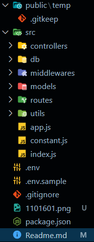
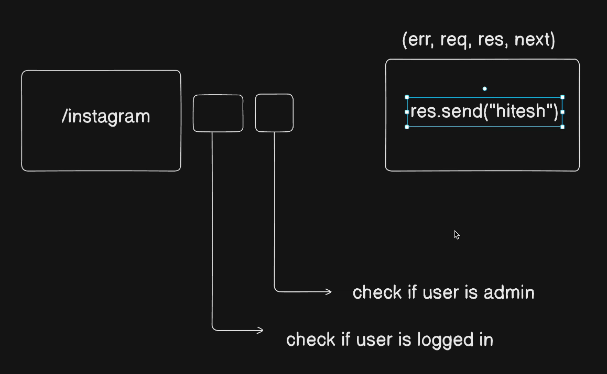
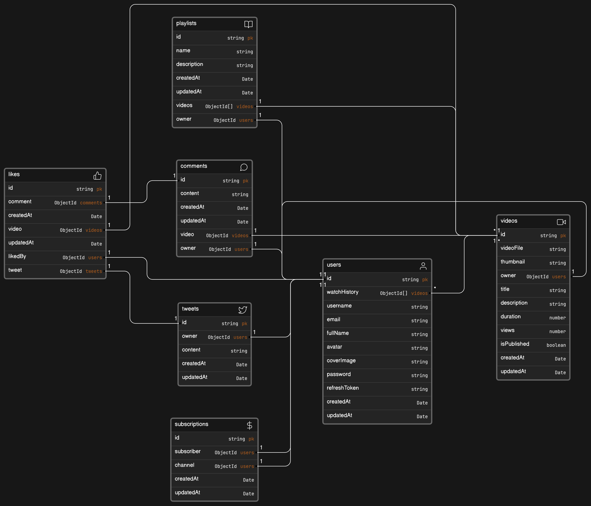

# GOKUTHECODER PRODUCTION BUILD BACKEND

This video series on backend with javascript

-[Model link](https://www.google.com)

## temp directory

usuallay this folder use to temproraly upload file then upload this file to 3rd party like aws , cloudnary

## .gitkeep

git not store empty folder so we keep here generalluy .gitkeep file keep on that folder which have no any file inside

## gitignore

This is use for , not push sensitive file and other unusual folder like node_modules , node_modules generate by hosting server , so we try to never push on github

 -[Gitignore generator](https://mrkandreev.name/snippets/gitignore-generator/)

## .env 

All sensitive data store here.

## .env.sample

In .env file all sensitive data store so we not need to push on github so we create an sample user see how to use .env file and how t that data store .

## src directory

I store my entry point(index.js), constant file and app.js

## package.json

In this file we add a "type": "module"

## nodemon package 

When we changes in our project then always we need to start project again and again, but nodemon automate this thing, when some changes in our project this will restart our project.

```javascript
npm install -g nodemon   
```
 -g means this dependency will be installed globally to your system path.

This will make main dependency and this is use in production and development.

```javascript
npm install --save-dev nodemon

or

npm install -D nodemon
```

This is dev dependency and it is used for only in development and we are use in this on Production .

## package.json

Go to in scripts and add

```
"dev":"nodemon src/index.js"
```

## create controllers, db,middlewares, models, routes and utils directory



- controllers : here we write our major functionality
  
- db : database connection logic
  
- middleware : we add an middleware just befrore fullfield request api
  
- models 
  
- routes : here we define our API routes

- utils : a "utility" directory typically contains utility functions or modules that are used across different parts of the application. These utility functions are often small, reusable pieces of code that perform common tasks or provide helper functionalities.
  
  e.g when user upload profile , user upload video on youtube , in this synario these two thing is same which is upload.

## Prettier


This is dependency is used for generally in development so we use as dev dependency:

```
npm install -D prettier
```

- Consistency in Code Style
  -  Prettier enforces a consistent code style across your codebase, which can improve readability and maintainability. By using npm to manage Prettier, you ensure that all developers working on the project use the same code formatting rules.

- Ease of Collaboration: 
  - When multiple developers work on a project, having a consistent code style is crucial for collaboration. By using Prettier via npm, everyone working on the project can easily format their code to match the project's style guidelines.

you can ignore this if you want .

 ## uses

 - first create a file in root directory name is  <mark><b>.prettierc</mark> & <mark>.prettierignore</mark></b>

## .prettierc

```javaScript
{
"singleQuote":false, //everywhere use only doubleQuote, no singleQuote

"bracketSpacing": true, // after bracket space allowed or not, i choose yes

"tabwidth": 2,// i choose 2 tab for me this whole project

"trailingComma":"es5", //Print trailing commas wherever possible in multi-line comma-separated syntactic structures. (A single-line array, for example, never gets trailing commas.)

"semi":true, // we need semicolon
}
```

## use of .prettierignore

Generally this file used purpose is, in which file or folder we not want to apply Prettier feature

## Connect DataBase

In database connection we need some thing URI String so we put this in .env

- we remove last<mark>&nbsp;/&nbsp;</mark> ,from my mongodb connection String .
- we need a name of my database so we set database name in <mark>Constant.js</mark> and export database name variable. if you want then you put database name in .env , no any issue becuse this is not any sensitive data .
  
## Two major approach of DataBase connection
- Put all db code in index.js (entry point), which is direct execute
- create a db directory inside this write fucntion and import it in index.js and execute . 

second approach is good because of this our code neat and clean

## 1st approach to connect with database

<mark>IN DATABASE CONNECTION, KEEP ONE THING IN MIND
</mark>

- <mark>when you try communicate with database then you faced problem , so always used try and catch or promises
- </mark>
 
* <mark>Database is always in another continent, so it take time so use async await
</mark>

### Install dotenv and mongoose package

```
npm i dotenv mongoose
```
### index.js root file

```javascript
import mongoose from "mongoose";
import { DB_NAME } from "./constant";
import express from "express"

const app = express()

; (async () => {
    try {
       await mongoose.connect(`${process.env.MONGODB_URI}/${DB_NAME}`)
       app.on("error", (error)=>{
        console.log("ERR", error);
        throw error
       })

       app.listen(process.env.PORT, (err)=>{
        console.log(`App is listening on port ${process.env.PORT}`)
       })
    } catch(error){
        console.log("ERROR", error)
    }
})()
```
* <b>Note</b>: Basically import mongoose and DB_NAME, 
* After that we create an iife function `;()()` (Immediately Invoked Function Expression) . Generally all pro coder use `;` use just before the iife function , to abstain global variable and function which has not end statement with semicolon.
`The use of iife for use for immediately invoked , as well as abstain from global pollution. we use iife .`

- we use connect method to connect database in `try` and `catch`
   
*  we write `app.on` which basically use for if after connection error in express then it show error
*  we execute iife function with `()`
  

## 2nd approach to connect with database(professional way)

<mark>This is major approach for connect to database as a professional developer</mark>

`src/db/index.js`
```javaScript
import mongoose from "mongoose";
import { DB_NAME } from "../constant.js"

const connectDB = async () => {
    try {
        const connectionInstance = await mongoose.connect(`${process.env.MONGODB_URI}/${DB_NAME}`)
        console.log(`\n MongoDB connected !!DB HOST: ${connectionInstance.connection.host}`);
    } catch (error) {
        console.log("MONGODB connection error", error)
        process.exit(1)
    }
}

export default connectDB
```
<b>In above code we create an function and export it, but two thing we done
 - I store database connection in a variable `connectionInstance` and this variable return object and this object many things are available. But my wish is is on which host my database connected, because most of pro developer in development and in production use different database so, they use it .
 If you want to be console `connectionInstance` then you got long object 
 

</b>

`src/index.js`
```javaScript
import connectDB from "./db/index.js";

connectDB()
```
* Now If i Run This Project Then it Will Give Error . Because in `src/db/index.js` enviroment variable not be accessable, the reason is we are not import our `dotenv` .
  
  so import dotenv 
```javaScript
require('dotenv').config()
```
this is perfectly work but this make our code Idle , so we try i it import using import keyword. 

```javaScript
import dotenv from "dotenv"

dotenv.config()
```

But notice thing is nowhere in docs. use this module import with `import dotenv from "dotenv"` . But we use this as a experimental feature , in package.json we add something .

`package.json`
```json
"dev": "nodemon -r dotenv/config --experimental-json-modules src/index.js"
```

we only import this module in main entry file `index.js`

```javaScript
import connectDB from "./db/index.js";
import dotenv from "dotenv"
require('dotenv').config({
  path: './env'
})

connectDB()
```

## app.js
In `src/app.js` we work on express 
```javaScript
import express from "express"
const app = express()

export { app } // export default app
```

Import in entry file
`src/index.js`
```javaScript
import connectDB from "./db/index.js";
import dotenv from "dotenv"
import {app} from "./app.js"

dotenv.config({
    path:'./env'
})

connectDB()
.then(()=>{
    app.listen(process.env.PORT || 8000 , ()=>{
        console.log(` Server is running at port : ${process.env.PORT}`);
    })

    app.on("error",(error)=>{
      console.log("ERROR", error);
      throw error
    })
})
.catch((err)=>{
    console.log('MONGO db connection failed !!!', err);
})

```
in connectDB we use async and await which is return promises so we use `then` & `catch` , and in `then` we listen our app .

---

# CLASSES FOR CUSTOM ERROR AND CUSTOM API RESPONSES 
- We are most of cases see express, how to get response from api and request to api .
- In request we learn req.body req.params , req.cookies.
- We also use middleware .
  
  ## Now it is time to insatll some package and discussion about that
  ```javaScript
  npm i cookie-parser
  npm i cors
  ```
  
  cors package allow us to setting cross origin resources.

  Most of time when you need to use middlware and setting some configuration then you need `use()`

  After install those package , i need to configure origin with `cors`.

  IN `app.js` we, import both package . If you remember we need to configure our origin and i use the as a middleware.

  ```javaScript
  app.use(cors())
  ``` 
  Generally all dev are configure origin write this type of code . But if you want some setting then you go through Express Docs then you one more thing . 
  - [Configuring CORS](https://www.npmjs.com/package/cors#configuring-cors)
  `app.js`
  ```javaScript
  app.use(cors({
      origin: 'https://whitelist.com' || process.env.CORS_ORIGIN,
      optionsSuccessStatus: 200,
      credentials:: true
  }))
  ```
  `.env`
  ```javaScript
  PORT=8000
  MONGODB_URI=mongodb+srv://<username>:<password>@cluster0.tdr3cvt.mongodb.net
  CORS_ORIGIN=*
  ```
  In this backend , many 'data' in comeform of json ,come from url , from database and some data from Form so we do not allow to come in server unlimited data, this will crash our server .
  So we apply an middleware -

  previous version of express , express do not allow JSON data, so we need to use body-parser package, but now express allow us to JSON data.

  ```javaScript
  app.use(express.json({ limit: "16kb" }))
  ```

  Sometimes data come from URL , so we need configuration that URL, because in url % and many other sign available, which have own meaning so , i say to  express  understand URL
  `https://www.google.com/search?q=express+js&rlz=1C1ONGR_enIN1062IN1062&oq=express+js&gs_lcrp=EgZjaHJvbWUyDwgAEEUYORiDARixAxiABDINCAEQABiDARixAxiABDINCAIQABiDARixAxiABDINCAMQABiDARixAxiABDIGCAQQBRhAMgYIBRBFGDwyBggGEEUYPDIGCAcQRRg90gEIMjU3MmowajeoAgCwAgA&sourceid=chrome&ie=UTF-8`

    ```javaScript
    app.use(express.urlencoded({ extended: true, limit: '16kb' }))
    ```
    if i want to add limit in URL, if i want data come from URL in specific size so we can apply limit .

    now we add one more configuration of express which is `static` , sometime we want to store file , pdf and image , so we want  to store in `public` directory.

    ```javaScript
    app.use(express.static('public'))
    ```

    ### why we install cookies-parser, how to use it
    `cookies-parser` working is from our server we access user browser cookies and set cookies user browser. Basically i will perform basic CRUD operation. Because some process to keep secure cookies in user browser which is only server can read and remove that . All production grade app use this .

    ```javaScript
    app.use(cookiesParser())
    ```
    Sometime we need own middleware, let an example of instagram, user request on `/instagram` then user got response, but before response i want to add a checker(middleware) , is this user whose request on `/instagram`is an admin of instagram , becuase access to this request user must be an admin, and login in instagram .
    if user fullfill this then give response this user .

    generally if go in express docs then you got in api method `(req,res)`, but actullay in api method we can pass 4 thing including  this `(err, req, res, next)`, 
    - err means error
    - req means request
    - res means response
    - next means middleware
      - we already discuss about middleware , check request just before response

    

  ### Discussion About DB
  Because of we many time , communicate with Database. So we always need to write Database connection Code.

  So, we make a utility file and make a wrapper generalised function, which function work is heyy! pass function in my method, i execute that and give you back . And this function we use `async` `await` and `try` `catch`

  `src/utils/asyncHandler.js`

  `short code`
  ```javaScript
    const asyncHandler = (fn) => () => {} // this is actually a Higher Order Function , because id an function take one or more function as a parameter or return a function as its result .
  ```
  `long code`
  ```javaScript
  const asyncHandler = (fn) => async (req, res, next) => {
    try {
        await fn(req, res, next)
    } catch (error) {
        res.status(err.code || 500).json({
            success: false,
            message: err.message
        })
    }
  } 
  ```
  instead of `fn` is a function name. But production grade code, you not decided to you write code only this method . So you need to know another method also , so we write code in another method, 
  instead of `try` `catch` we use `promises`.

  ```javaScript
  const asyncHandler = (requestHandler) => {
    (req, res, next) => {
        Promise.resolve(requestHandler)
            .catch((err) => next(err))
    }
  }
  ```
  One thing which is we need to make an Standarised format , error always come in this fix format

  `src/utils/ApiError.js`

  ```javaScript
  class ApiError extends Error {
    constructor(
        statusCode,
        message = "Something went wrong",
        error = [],
        stack = ""
    ) {
        super(message)
        this.statusCode = statusCode
        this.data = null
        this.message = message
        this.success = false
        this.errors = errors

        if (stack) {
            this.stack = stack
        } else {
            Error.captureStackTrace(this, this.constructor)
        }
    }
  }
  export { ApiError }
  ```
  🤔 You think okay we make custom ApiError then is it possible to make ApiResponce , so you need to know Error class defined in core node, Response not defined in node, this is defined in Express .

  `src/utils/ApiResponse.js`
  ```javaScript
    class ApiResponse {
    constructor(statusCode, data, message = "Success") {
        this.statusCode = statusCode
        this.data = data
        this.message = message
        this.success = statusCode < 400
    }
  }

  export { ApiResponse }
  ```
  In Api Response Status Code defined , but you can overwrite this 
  * Informational responses (100 199)
  * Successful responses (200 – 299)
  * Redirection messages (300 – 399)
  * Client error responses (400 – 499)
  * Server error responses (500 - 599)

## Create Model

  <mark><b>MONGODB save data in BSON, means save data in binary format while json save json text based format<b/></mark>



  `user.model.js`
  ```javaScript
    import  mongoose from "mongoose";

  const userSchema = new mongoose.Schema(
    {
        username : {
            type: String,
            required: true,
            uniq: true,
            lowercase: true,
            trim: true,
            index: true //it is better option to enable searching option, with it work but it is optimized
        },
        email: {
            type: String,
            required: true,
            uniq: true,
            lowercase: true,
            trim: true,
        },
        fulname: {
            type: String,
            required: true,
            trim: true,
            index: true
        },
        avatar: {
            type: String, //cloudinary url
            required: true,
        },
        coverImage : {
            type: String, //cloudinary url
        },
        watcHistory : {
            type: mongoose.Schema.Types.ObjectId,
            ref: "Video"
        },
        password : {
            type: String,
            required: [true, "password is required"]
        },
        refreshToken: {
            type: String
        }
    }, {timestamps: true})

    export const User = mongoose.model("User", userSchema)
  ```
  
   `video.model.js`
  ```javaScript
  import mongoose from "mongoose";

  const videoSchema = new mongoose.Schema(
    {
        videoFile: {
            type: String, // cloudinary url
            required: true
        },
        thumbnail  : {
            type: String,
            required: true
        },
        title: {
            type: String,
            required: true
        },
        duration: {
            type: Number,
            required: true
        },
        views: {
            type: Number,
            default: true
        },
        isPublished: {
            type: Boolean,
            default: true
        },
        owner: {
            type: mongoose.Schema.Types.ObjectId,
            ref: "User"
        }
    }, { timestamps: true })

    export const Video = mongoose.model("Video", videoSchema)
  ```

  ## intall mongoose-aggregate-paginate-v2 package

  ```javascript
  npm install mongoose-aggregate-paginate-v2
  ```

  Here are a few reasons why you might need this plugin:

  * Simplified Pagination
  * Efficiency
  * Consistency
  * Ease of Use
  
  It is very simple to use,
  * import it you model 
  * `yourSchema.plugin()` it is basically mean i say to mongoose , hey mongoose i want to use an plugin .
  ```javaScript
  import mongoose from "mongoose";
  import mongooseAggregatePaginate from "mongoose-aggregate-paginate-v2";

  const videoSchema = new mongoose.Schema(
    {
        videoFile: {
            type: String, // cloudinary url
            required: true
        },
        thumbnail  : {
            type: String,
            required: true
        },
        title: {
            type: String,
            required: true
        },
        duration: {
            type: Number,
            required: true
        },
        views: {
            type: Number,
            default: true
        },
        isPublished: {
            type: Boolean,
            default: true
        },
        owner: {
            type: mongoose.Schema.Types.ObjectId,
            ref: "User"
        }
    }, { timestamps: true })

    videoSchema.plugin(mongooseAggregatePaginate)

    export const Video = mongoose.model("Video", videoSchema)
   ```

## Now install bcrypt and jsonwebtoken

```javaScript
npm i bcrypt jsonwebtoken
```

Bcrypt is use for hashing password and json-web-token is used for generate token

we directly not hash password using bcrypt so we need help of mongoose `pre` hook. we can execute this hook just before save data in database . so just encrypt password using this hook .

```javaScript
userSchema.pre("save", async function (next) {     
    this.password = bcrypt.hash(this.password, 10)
    next()
 })
```

okay the issue in this code when user update something then always password change, so we add a logic whenever password not changes then not change password.

```javaScript
userSchema.pre("save", async function (next) { 
    if(!this.isModified("password")) return next()
    
    this.password = bcrypt.hash(this.password, 10)
    next()
 })
```

we make own methods with mongoose 

```javaScript
//Password check
 userSchema.methods.ispasswordCorrect = async function
 (password){
    return await bcrypt.compare(password, this.password)
 }
```
<mark>JWT is a beerer token, it is like a like which has this token , if any send this token then they got data</mark>

```c
PORT=8000
MONGODB_URI=mongodb+srv://<username>:<password>@cluster0.tdr3cvt.mongodb.net
CORS_ORIGIN=*
ACCESS_TOKEN_SECRET=YOUR_REFRESH_TOKEN_EXPIRY
ACCESS_TOKEN_EXPIRY=1d
REFRESH_TOKEN_SECRET=YOUR_REFRESH_TOKEN_SECRET
REFRESH_TOKEN_EXPIRY=10d
```
But here is noticable thing is we store only `REFRESH_TOKEN_SECRET (refreshToken)`) in database but `ACCESS_TOKEN_SECRET` not store in database. Because we use `session` and `cookies` .

so we make own method to generate `accessToken`

```javaScript
userSchema.methods.generateAccessToken = function () {
    return jwt.sign(
        {
            _id: this._id,
            email: this.email,
            username: this.username,
            fullName: this.fullName
        },
        process.env.ACCESS_TOKEN_SECRET,
        {
            expiresIn: process.env.ACCESS_TOKEN_EXPIRY
        }
    )
}

userSchema.methods.generateRefreshToken = function () {
    return jwt.sign(
        {
            _id: this._id
        },
        process.env.REFRESH_TOKEN_SECRET,
        {
            expiresIn: process.env.REFRESH_TOKEN_EXPIRY
        }
    )
}
```

we discuss aboth this refresh token and access token , simply remember this thing we not pass many information in `generateRefreshToken`

## File uploading
on backend not store any docuemnt or media file, we upload all file on 3rd party website


## HTTP CRASH COURSE
Hyper Text Transfer Protocol

*URL: Uniform Resource Locator
* URI: Uniform Resource Identifier
* URN: Uniform Resource Name
  
## what are HTTP headers
   when  you send HTTP request then we need to send request with additional data(like when file created , what file name, when file created, when file updated), this information called HTTP header .

   This HTTP headers is a metadata(data about data)

`metadata` -> key-value sent along with request & response

if you sent reuest from postman, browser and programmetically then all these http header sent different .

headers also comes from response

## what is functions of headers

many function perform by headers, but some function are here like caching, authentication, manage state .


